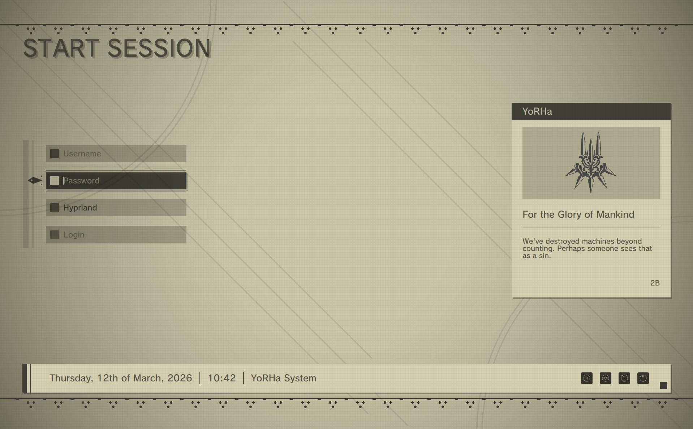
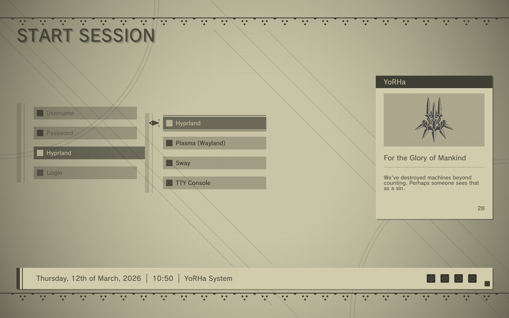

!! Blatanly stolen code from [SDDM Sugar Dark](https://github.com/MarianArit/sddm-sugar-dark) !!

## Previews

## Features
- The user will be shown with a **Capital Letter** regardless of the typed case, this is only a graphical effect
- Last logged in user will be used as text placeholder
- Random quotes will be fetched from the [Quotes Folder](./Quotes/)
    - The quote file selected can be changed in the [LoginForm.qml](./Components/LoginForm.qml)
    - Every line will be read as a single quote, everything after a tilde (~) will be considered as the source of the quote and will be placed in the bottom right